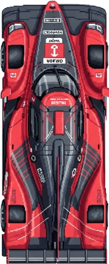
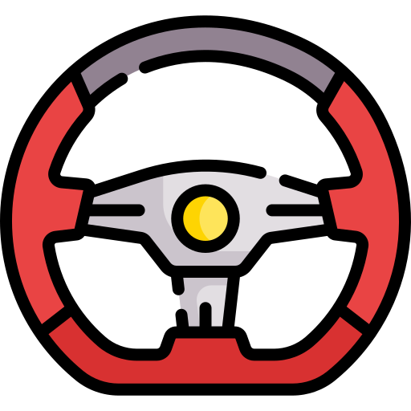

# 2D Android Racing Game (Under Development) 🏎️

This is an early-stage, initial prototype of a 2D Android racing game built entirely using modern UI development with **Jetpack Compose**. 

⚠️ **IMPORTANT NOTE:** This project is currently **under active development** and is **NOT** a completed game. More features, tracks, and physics will be added in future updates.

## Current Features Implemented:
* **Car Model Rendering:** The red car asset is rendered and managed dynamically inside a `Canvas` using custom transformations (translation, rotation, and scaling).
* **Interactive Steering Wheel:** A fully functional on-screen steering wheel UI component that detects user drag gestures.
* **Rotation & Control Logic:** Implemented math logic using `atan2` to calculate drag angles, allowing the player to rotate the steering wheel, which directly and smoothly influences the car's orientation.
* **Auto-Centering Wheel:** The steering wheel automatically resets to its default position (`0f`) once the user stops dragging.

## Tech Stack & Concepts Used:
* **Kotlin** & **Jetpack Compose**
* **Compose Canvas & Canvas Transformations** (`withTransform`, `rotate`, `translate`)
* **Pointer Input & Gesture Detection** (`detectDragGestures`)
* **Trigonometric Math** (`atan2` for angle calculation)

## Screenshots
Racing car 1:   
The steering wheel:   

---
*Stay tuned for more updates as the game logic expands!*
